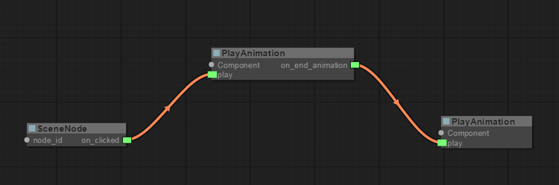
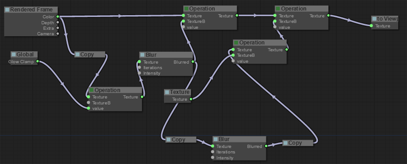

# Graphs #

Besides using Scripts to control behaviour and rendering passes, you can also use Graphs.

A Graph contains nodes representing elements of your scene, and wires to transfer actions or data between the nodes.

This way you can set up simple behaviours without the need of using code and in a more transparent way.

You can also use graphs to control the rendering postprocessing effects using the FXGraphComponent.

To know more about graphs check [LiteGraph.js](https://github.com/jagenjo/litegraph.js)
