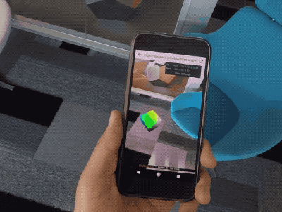
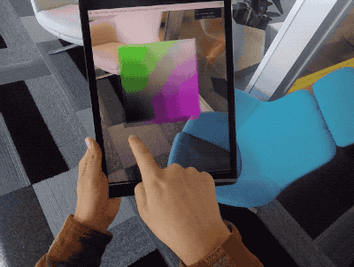

# three.ar.js

[](https://travis-ci.org/google-ar/three.ar.js)
[](https://www.npmjs.org/package/three.ar.js)
[](https://www.npmjs.org/package/three.ar.js)
[](https://www.npmjs.org/package/three.ar.js)

**A helper three.js library for building AR web experiences that run in WebARonARKit and WebARonARCore.**



[WebARonARKit] and [WebARonARCore] are experimental apps for iOS and Android that let developers create Augmented Reality (AR) experiences using web technologies. three.ar.js makes it easier to create these experiences by providing helper classes and utilities on top of the [three.js] 3D library, which interfaces with the [WebVR Extension for AR] exposed by [WebARonARKit] and [WebARonARCore]. For example:

* THREE.ARReticle: a visible reticle drawn on the real surface of real world objects.
* THREE.ARPerspectiveCamera: a camera that matches your [three.js] scene to your camera's video feed.

See [three.ar.js API documentation](API.md) for details.

## Installing

### CDN

```html
<script src="https://cdn.jsdelivr.net/npm/three.ar.js@latest/dist/three.ar.js"></script>
<!-- or the minified version -->
<script src="https://cdn.jsdelivr.net/npm/three.ar.js@latest/dist/three.ar.min.js"></script>
```

### Script

Download the build at [dist/three.ar.js](dist/three.ar.js) and include it as a script tag in a web page. You must include [three.js] as well, and three.ar.js must be included after.

```html
<script src='three.js'></script>
<script src='three.ar.js'></script>
```

### npm

If you're using a build tool, like [browserify] or [webpack], install it via [npm]. Note you must also have [three.js] installed via npm.

```
$ npm install --save three three.ar.js
```

## Using

Accessing three.ar.js depends on the environment you're working in. Below are examples of importing
the code via script tag, as well as a module bundler like [browserify] or [webpack].

To view the additional APIs implemented by [WebARonARKit] and [WebARonARCore], view the [WebVR Extension for AR] document.

For more examples, see the [examples/](examples/) directory.

See the full [three.ar.js API documentation](API.md) for more details.


### Script

If you are including three.ar.js via script tag, the additional three.ar.js features are appended to the `THREE` namespace, for example:

```js
/**
 * Not a full working example -- see the `examples/` directory
 */
THREE.ARUtils.getARDisplay().then(init);

function init(display) {
  vrDisplay = display;
  // Set up three.js scene
  renderer = new THREE.WebGLRenderer({ alpha: true });
  scene = new THREE.Scene();

  // ...

  // Set up our ARView with ARPerspectiveCamera
  arView = new THREE.ARView(vrDisplay, renderer);
  camera = new THREE.ARPerspectiveCamera(vrDisplay, 60, window.innerWidth / window.innerHeight, vrDisplay.depthNear, vrDisplay.depthFar);
  vrControls = new THREE.VRControls(camera);

  update();
}

function update() {
  // Update our controls/camera, the ARView rendering,
  // and our three.js scene
  vrControls.update();
  arView.render();
  renderer.clearDepth();
  renderer.render(scene, camera);
  vrDisplay.requestAnimationFrame(update);
}
```

### Modules

If you're in a [browserify] or [webpack] like environment, three.ar.js uses [three.js]
as a peer dependency. This means you can import both packages separately.

```js
import { Scene, WebGLRenderer } from 'three';
import { ARUtils, ARPerspectiveCamera, ARView } from 'three.ar.js';

async function init() {
  const display = await ARUtils.getARDisplay();
  const renderer = new WebGLRenderer({ alpha: true });
  const arView = new ARView(display, renderer);

  // And so forth...
}
```

## Contributing

If you're developing and modifying the three.ar.js library itself, there are some helpful build tools for you.

### Installing Dependencies

Run `npm install` to install dependencies required for this project.

### Building

Run `npm run build` to create a new build in `./dist`. When sending pull requests, do **not** build your changes and allow maintainers to do so. There are additional commands for building, like `npm run build-min` for building the minified file, and `npm run build-all` for building both.

To auto build when the source changes, run `npm run watch`.

### Linting

Run `npm run lint` to run the linter on code in `src/`.

### Testing

Right now, there are only linting tests. To run the tests, execute:

```
$ npm test
```

For testing functionality, go through the examples with your changes and ensure the expected functionality.

### Releasing a new version

For maintainers, to cut a new release for npm, use the [npm version] command. The `preversion`, `version` and `postversion` npm scripts will run tests, build, add built files and tag to git, push to github, and publish the new npm version.

`npm version <semverstring>`

## Examples

Examples of three.ar.js are in the `/examples` directory.

A [list of examples](https://developers.google.com/ar/develop/web/getting-started#examples) that are compatible with [WebARonARKit] and [WebARonARCore] is also available at [developers.google.com].

Created a cool example or want to see more from the community? Check out [this gist](https://gist.github.com/jsantell/871d7e709e5007533f3bf07c35434e29) with some links. Leave a comment to add yours!

## License
Apache License Version 2.0 (see the `LICENSE` file inside this repo).

[three.js]: https://threejs.org/
[adb]: https://developer.android.com/studio/command-line/adb.html
[npm]: https://www.npmjs.com
[browserify]: http://browserify.org/
[webpack]: https://webpack.github.io/
[WebARonARKit]: https://github.com/google-ar/WebARonARKit
[WebARonARCore]: https://github.com/google-ar/WebARonARCore
[developers.google.com]: https://developers.google.com/ar/develop/web/getting-started#examples
[WebVR Extension for AR]: webvr_ar_extension.md
[npm version]: https://docs.npmjs.com/cli/version
